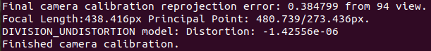
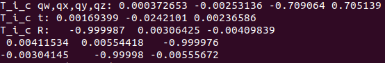
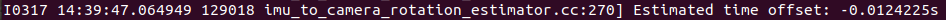

# vilota_assessment

## Requirement

open3d, spatialmath-python, numpy

Recommended to use conda: 
```
conda env create -f environment.yml
```
```
conda activate vilota-1
```
## Explanation

### Assessment 1

### First script

This script visualizes three transformations, the first is pure translation, the second is rotation + translation, the third is the second one incorporated with a translation.


### Second script

This script visualizes a bounding box representing the camera wireframe that is rotating and translating in the 3D space. The DoF is 6 and the motion can be modified. For simplicity, I didn't use the parser to make it more convinient to customize the motion, etc.

The gifs first visualize the trajectory of the wireframe, then the fixed view on the camera (cannot see the translation)


### Assessment 2

This script applies the transformation of an fisheye camera model to transform a scenery image.

Given an image, first the coordinate is transformed into the camera coordinate using given intrinsic parameters. Then, referring to https://zhuanlan.zhihu.com/p/511284263, the coordinate is distorted using formulas. The result is shown below.


### Assessment 3

Environment Setup:

The steps to configure OICC are followed. I had OpenCV version > 4.5.0 installed already, so the first step is skipped. For Ceres-solver, I had different version, so it was reinstalled. requiring a corresponding eigen library, for which I also reinstalled eigen.

However, when compiling the OICC, it indicated that there were some functions not defined in OpenCV. I suspected it was because the version I used have some changes that cause the issue. So OpenCV needs to be reinstalled.

When compiling OpenCV, I faced some issues. I solved them by

1. Added flag to the command to use C++14 for compiling (Initially it used C++11 that caused an issue)

2. Added flag to let tiff be built to avoid the miscorrespondance of tiff version

3. conda deactivate to avoid unabling to find some libraries.

The command I used to configure is 
```
cmake -DOPENCV_EXTRA_MODULES_PATH=../opencv_contrib-4.5.0/modules       -DOPENCV_ENABLE_NONFREE=ON       -DCMAKE_CXX_STANDARD=14       ../opencv-4.5.0       -D BUILD_TIFF=ON
```

OICC was successfully compiled after these were done.

After calibration, the results are illustrated below.

Camera intrinsic values: 


IMU to camera transformation:


IMU to camera time offset:

