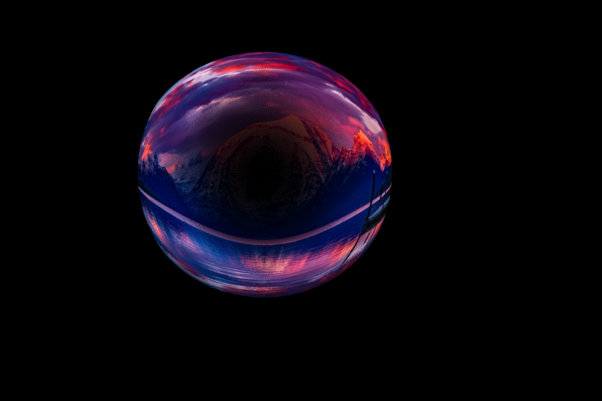

# vilota_assessment

## Requirement

open3d, spatialmath-python, numpy

Recommended to use conda: 
```
conda env create -f environment.yml
```
```
conda activate vilota-1
```
## Explanation

### Assessment 1

### First script

This script visualizes three transformations, the first is pure translation, the second is rotation + translation, the third is the second one incorporated with a translation.


### Second script

This script visualizes a bounding box representing the camera wireframe that is rotating and translating in the 3D space. The DoF is 6 and the motion can be modified. For simplicity, I didn't use the parser to make it more convinient to customize the motion, etc.

The gifs first visualize the trajectory of the wireframe, then the fixed view on the camera (cannot see the translation)


### Assessment 2

This script applies the transformation of an fisheye camera model to transform a scenery image.

Given an image, first the coordinate is transformed into the camera coordinate using given intrinsic parameters. Then, referring to https://zhuanlan.zhihu.com/p/511284263, the coordinate is distorted using formulas. The result is shown below.




